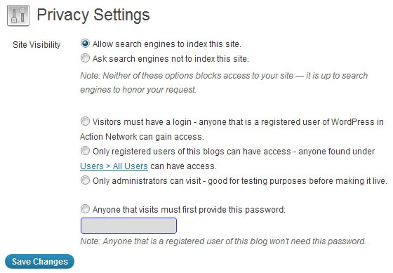

# Multisite Privacy

  <a href="https://cp-psource.github.io/ps-multisite-privacy/" style="text-decoration: none; color: #0366d6; font-weight: bold;">Home</a>
  <a href="https://github.com/cp-psource/ps-multisite-privacy/releases" style="text-decoration: none; color: #0366d6; font-weight: bold;">Downloads</a>
  <a href="https://github.com/cp-psource/ps-multisite-privacy/wiki" style="text-decoration: none; color: #0366d6; font-weight: bold;">Docs</a>
  <a href="https://github.com/cp-psource/ps-multisite-privacy/discussions" style="text-decoration: none; color: #0366d6; font-weight: bold;">Support</a>
  <a href="https://github.com/cp-psource/ps-multisite-privacy/issues" style="text-decoration: none; color: #0366d6; font-weight: bold;">Bug Report</a>
  <a href="https://github.com/cp-psource/ps-multisite-privacy/psource.html" style="text-decoration: none; color: #0366d6; font-weight: bold;">PSOURCE</a> 

## Multisite Privacy fügt netzwerkweite Datenschutzebenen hinzu und ermöglicht Dir zu entscheiden, ob Benutzer diese außer Kraft setzen können.

### Mehr Ebenen, mehr Kontrolle

Dieses Plugin gibt Dir die volle Kontrolle über die Privatsphäre in Deinem Netzwerk.  

##### Es enthält alles, was Du brauchst, und noch viel mehr:

* Fügt zu **Einstellungen > Lesen**“** im Webseiten-Admin-Dashboard vier neue Datenschutzoptionen hinzu.
* Wähle aus, welche Datenschutzoptionen Deinen Benutzern zur Verfügung gestellt werden!
* Problemlose Benutzeroberfläche.  Das Ändern der Privatsphäre in Deinem Netzwerk ist so einfach wie das Aktualisieren Deiner         Einstellungen im Netzwerkadministrator-Dashboard.
* Möglichkeit, Benutzern bei der Anmeldung für ihre neue Webseite die Auswahl ihrer bevorzugten Datenschutzoption zu ermöglichen.
* Kontrolliere die Standard-Datenschutzeinstellungen aller neuen Webseiten, die in Deinem Netzwerk erstellt werden.
* Aktualisiere ganz einfach die Datenschutzeinstellungen aller Webseiten in Deinem gesamten Netzwerk gleichzeitig!
* Kontrolliere die Möglichkeit der Benutzer, die standardmäßigen Datenschutzeinstellungen zu überschreiben
* Funktioniert perfekt mit Multisite und BuddyPress.
* Verwende dieses Plugin für jedes Multisite-Projekt.

##### Hier sind Deine vier neuen Datenschutzoptionen:

1. Erlaube allen registrierten Benutzern im Netzwerk, die Webseite anzuzeigen.
2. Erlaube nur Abonnenten oder Benutzern der Webseite, sie anzuzeigen.
3. Erlaube nur den Administratoren der Webseite den Zugriff – ideal für Testzwecke.
4. Für den Zugriff auf die Webseite ist ein Passwort erforderlich. So können nur die Personen auf die Webseite zugreifen, die Du möchtest, ohne dass diese über ein Benutzerkonto verfügen müssen!

### Intelligente Einstellungen

Zur schnellen Einrichtung kannst Du die Optionen im Administrator-Dashboard umschalten. 

 Einfache Datenschutzkonfiguration

   Multisite Privacy gibt Dir mehr Kontrolle ohne den Aufwand eines vollständigen [Mitgliedschaften](https://cp-psource.github.io/mitgliedschaften-pro/) Plugins.

## Verwendung

 

 Datenschutzeinstellungen in den Einstellungen im Netzwerkadministrator-Dashboard

#### Datenschutzoptionen bei der Anmeldung anzeigen

Die Option **Datenschutz bei Anmeldung anzeigen** wird angezeigt, wenn unter den Registrierungseinstellungen in **Einstellungen  > Netzwerkeinstellungen** im Netzwerkadministrator-Dashboard entweder **Angemeldete Benutzer können neue Sites registrieren** oder **Sowohl Webseiten als auch Benutzerkonten können registriert werden** ausgewählt ist. Wenn **Ja** ausgewählt ist, können Benutzer beim Erstellen ihrer Webseite ihre bevorzugten Datenschutzoptionen festlegen. So sehen die Datenschutzoptionen auf der Anmeldeseite aus, wenn **JA** ausgewählt ist: 

 

 Auswählen des Datenschutzes bei der Anmeldung für eine neue Webseite

#### Verfügbare Optionen

Mit den verfügbaren Optionen kann der Superadministrator steuern, welche Datenschutzoptionen unter **Einstellungen > Lesen** im Webseiten-Admin-Dashboard angezeigt werden. So sehen die Datenschutzoptionen aus, wenn alle in den Netzwerkeinstellungen ausgewählt sind:

 Datenschutzoptionen unter „Datenschutz“ im Webseiten-Admin-Dashboard

#### Standardeinstellungen

Die Standardeinstellungen steuern die Datenschutzeinstellungen aller neu erstellten Websites. Wenn Du beispielsweise alle neu erstellten Webseiten privat machen möchtest, wähle eine der folgenden Optionen:

1. **Nur angemeldeten Benutzern das Anzeigen aller Blogs erlauben** – jeder registrierte Benutzer Deines Netzwerks, der bei seinem Konto angemeldet ist, kann die Webseite anzeigen.  Ideal, wenn Du Webseiiten privat machen möchtest, ohne einzelnen Webseiten Benutzer hinzuzufügen.
2. **Erlaube registrierten Benutzern nur, die Blogs anzuzeigen, für die sie registriert sind.** – Jeder registrierte Benutzer der Webseite, der bei seinem Konto angemeldet ist, kann die Webseite anzeigen, d.h. jeder, der als Benutzer zur Webseite hinzugefügt wurde und unter **Benutzer > Alle Benutzer** aufgeführt ist. Wird verwendet, wenn Du den Zugriff auf bestimmte Personen beschränken möchtest.
3. **Erlaube nur Administratoren eines Blogs, das Blog anzuzeigen, für das sie Administrator sind.** – Jeder registrierte Administratorbenutzer der Webseite, der bei seinem Konto angemeldet ist, kann die Webseite anzeigen. Ideal für Testzwecke, bevor eine Webseite öffentlich gemacht wird.

#### Überschreiben zulassen

Mit **Außerkraftsetzen** kannst Du festlegen, ob Blog-Administratoren die Datenschutzeinstellungen unter **Einstellungen > Lesen** ändern können. Du würdest beispielsweise **Nein** auswählen, wenn Du alle Webseiten privat halten möchtest.

#### Alle Webseiten aktualisieren

**Alle Webseiten aktualisieren** dient zum Aktualisieren der Datenschutzeinstellungen auf allen Webseiten in Deinem Netzwerk. Du würdest **Alle Webseiten aktualisieren** beispielsweise verwenden, wenn Deine Standardeinstellung **Alle Blogs allen Besuchern erlauben** lautet und Du alle Webseiten schnell privat machen musst.

### Bitte beachte:

1. Wähle **Alle Webseiten aktualisieren** aus, um vorhandene Blogs zu aktualisieren und die Aktualisierung auf alle neu erstellten Blogs anzuwenden.
2. Wähle **Alle Blogs aktualisieren** nicht aus, wenn die neuen Datenschutzstandards nur für alle neu erstellten Webseiten gelten sollen.
3. **Alle Webseiten aktualisieren** aktualisiert nicht die Datenschutzeinstellungen der Hauptseite.  Das liegt daran, dass auf der Hauptseite häufig die Einstellung **Allen Besuchern Zugriff auf alle Blogs erlauben** vorgenommen wird, damit Du auf der Hauptseite Community-Support und Hilfe anbieten kannst. Um die Datenschutzeinstellungen der Hauptseite zu ändern, musst Du im Webseiten-Admin-Dashboard der Hauptseite zu **Einstellungen > Lesen** gehen.

### Ändern der Datenschutzeinstellungen für einzelne Webseiten

Du kannst die Datenschutzeinstellungen einer Webseite wie folgt ändern:

1. Melde Dich beim Webseiten-Admin-Dashboard der Webseite an. 
2. Gehe zu **Einstellungen > Lesen**. 
3. Wähle Deine neue Datenschutzeinstellung. 
4. Klicke auf **Änderungen speichern**.

 Ändern der Privatsphäre im Webseiten-Admin-Dashboard

  <a href="https://cp-psource.github.io/ps-multisite-privacy/" style="text-decoration: none; color: #0366d6; font-weight: bold;">Home</a>
  <a href="https://github.com/cp-psource/ps-multisite-privacy/releases" style="text-decoration: none; color: #0366d6; font-weight: bold;">Downloads</a>
  <a href="https://github.com/cp-psource/ps-multisite-privacy/wiki" style="text-decoration: none; color: #0366d6; font-weight: bold;">Docs</a>
  <a href="https://github.com/cp-psource/ps-multisite-privacy/discussions" style="text-decoration: none; color: #0366d6; font-weight: bold;">Support</a>
  <a href="https://github.com/cp-psource/ps-multisite-privacy/issues" style="text-decoration: none; color: #0366d6; font-weight: bold;">Bug Report</a>
  <a href="https://github.com/cp-psource/ps-multisite-privacy/psource.html" style="text-decoration: none; color: #0366d6; font-weight: bold;">PSOURCE</a> 

 <a href="https://github.com/cp-psource">Copyright PSOURCE 2024</a>

