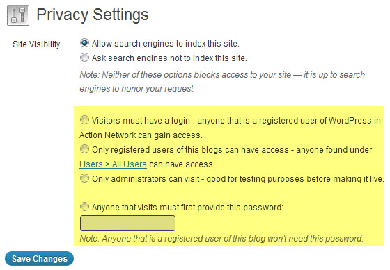

# Multisite Privacy

  <a href="https://cp-psource.github.io/ps-multisite-privacy/" style="text-decoration: none; color: #0366d6; font-weight: bold;">Home</a>
  <a href="https://github.com/cp-psource/ps-multisite-privacy/releases" style="text-decoration: none; color: #0366d6; font-weight: bold;">Downloads</a>
  <a href="https://github.com/cp-psource/ps-multisite-privacy/wiki" style="text-decoration: none; color: #0366d6; font-weight: bold;">Docs</a>
  <a href="https://github.com/cp-psource/ps-multisite-privacy/discussions" style="text-decoration: none; color: #0366d6; font-weight: bold;">Support</a>
  <a href="https://github.com/cp-psource/ps-multisite-privacy/issues" style="text-decoration: none; color: #0366d6; font-weight: bold;">Bug Report</a>
  

## Multisite Privacy fügt netzwerkweite Datenschutzebenen hinzu und ermöglicht Dir zu entscheiden, ob Benutzer diese außer Kraft setzen können.

### Mehr Ebenen, mehr Kontrolle

Dieses Plugin gibt Dir die volle Kontrolle über die Privatsphäre in Deinem Netzwerk.  

##### Es enthält alles, was Du brauchst, und noch viel mehr:

*   Fügt zu **Einstellungen > Lesen**“** im Webseiten-Admin-Dashboard vier neue Datenschutzoptionen hinzu.
*   Wähle aus, welche Datenschutzoptionen Deinen Benutzern zur Verfügung gestellt werden!
*   Problemlose Benutzeroberfläche.  Das Ändern der Privatsphäre in Deinem Netzwerk ist so einfach wie das Aktualisieren Deiner         Einstellungen im Netzwerkadministrator-Dashboard.
*   Möglichkeit, Benutzern bei der Anmeldung für ihre neue Webseite die Auswahl ihrer bevorzugten Datenschutzoption zu ermöglichen.
*   Kontrolliere die Standard-Datenschutzeinstellungen aller neuen Webseiten, die in Deinem Netzwerk erstellt werden.
*   Aktualisiere ganz einfach die Datenschutzeinstellungen aller Webseiten in Deinem gesamten Netzwerk gleichzeitig!
*   Kontrolliere die Möglichkeit der Benutzer, die standardmäßigen Datenschutzeinstellungen zu überschreiben
*   Funktioniert perfekt mit Multisite und BuddyPress.
*   Verwende dieses Plugin für jedes Multisite-Projekt.

##### Hier sind Deine vier neuen Datenschutzoptionen:

1.  Erlaube allen registrierten Benutzern im Netzwerk, die Webseite anzuzeigen.
2.  Erlaube nur Abonnenten oder Benutzern der Webseite, sie anzuzeigen.
3.  Erlaube nur den Administratoren der Webseite den Zugriff – ideal für Testzwecke.
4.  Für den Zugriff auf die Webseite ist ein Passwort erforderlich. So können nur die Personen auf die Webseite zugreifen, die Du möchtest, ohne dass diese über ein Benutzerkonto verfügen müssen!

### Intelligente Einstellungen

Zur schnellen Einrichtung kannst Du die Optionen im Administrator-Dashboard umschalten. 

 Einfache Datenschutzkonfiguration

   Multisite Privacy gibt Dir mehr Kontrolle ohne den Aufwand eines vollständigen [Mitgliedschaften](https://cp-psource.github.io/mitgliedschaften-pro/) Plugins.

## Verwendung

 

 Datenschutzeinstellungen in den Einstellungen im Netzwerkadministrator-Dashboard

#### Datenschutzoptionen bei der Anmeldung anzeigen

Die Option „Datenschutz bei Anmeldung anzeigen“ wird angezeigt, wenn unter den Registrierungseinstellungen in **Einstellungen  > Netzwerkeinstellungen** im Netzwerkadministrator-Dashboard entweder **Angemeldete Benutzer können neue Sites registrieren** oder **Sowohl Webseiten als auch Benutzerkonten können registriert werden** ausgewählt ist. Wenn **Ja** ausgewählt ist, können Benutzer beim Erstellen ihrer Webseite ihre bevorzugten Datenschutzoptionen festlegen. So sehen die Datenschutzoptionen auf der Anmeldeseite aus, wenn **JA** ausgewählt ist: 

 

 Auswählen des Datenschutzes bei der Anmeldung für eine neue Webseite

#### Verfügbare Optionen

Available options allows the Super admin user to control which of the privacy options are displayed in **Settings > Reading** in the site admin dashboard. Here's what the privacy options look like when all are selected in network settings: 

#### Default Settings

Default settings control the Privacy setting of all newly created sites. For example, if you wanted to make all newly created sites private you would choose either:

1.  **Only allow logged in users to see all blogs** - any one who is a registered user on your network, and who is logged into their account will be able to view the site.  Ideal if you want to make sites private without adding users to individual sites.
2.  **Only allow a registered user to see a blog for which they are registered to** -  any one who is a registered user of the site and who is logged into their account will be able to view the site .i.e anyone who has been added as a user to site and is listed in Users > All Users.  Used when you want to limit access to specific people.
3.  **Only allow administrators of a blog to view the blog for which they are an admin** -  any one who is a registered admin user of the site and who is logged into their account will be able to view the site.  Ideal for testing purpose before making a site public.

#### Allow Override

Allow Override lets you decide if blog admin users are able to change privacy options in Settings > Reading. For example, you would select 'No' if you needed to keep all sites private.

#### Update All Sites

Update all Sites is designed to update the privacy settings on all sites across your network. For example, you would use Update all Sites if your default setting was 'Allow all visitors to all blogs' and you needed to make all sites private quickly.

### Please Note:

1.  Select ‘Update All Sites’ to update existing blogs and apply to all new ones being created.
2.  Don’t select ‘Update All Blogs’ if you only want new privacy defaults to apply to all new sites being created.
3.  Update All Sites does not update the Privacy Settings of the main site.  This is because it is common to make the main site 'Allow all visitors to all blogs' so you can provide community support and help on the main site.  To change the Privacy setting of the main site you need to go to Settings > Reading in the site admin dashboard of the main site.

### Changing Privacy Settings on a site by site basis

You can change the privacy of a site by: 1.  Logging into the site admin dashboard of the site 2.  Go to **Settings > Reading** 3.  Select your new privacy setting. 4.  Click **Save Changes**. 

